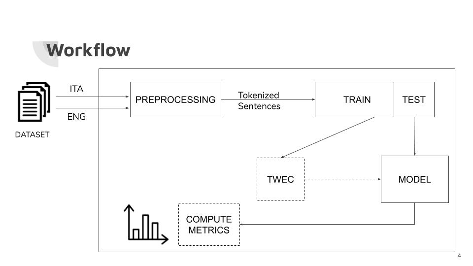

# Compass aligned distributional embeddings with language shift
#### AI project 2019/20 - Università degli studi di Milano Bicocca
Development of **TWEC** method *[Palmonari et al.]* with Language shift

## Aim of the project
+ Verify that **vector representation** of a world translated in **different** languages is **similar**
+ We used **TWEC** approach to **align** the document translated in different languages
+ We used TWEC as-is and a TWEC personal modified version that we called **TWEC-IIS** *(Identify injection substitution)*
+ Obtained results analysis

## Dataset
+ Proceedings of the EUROPEAN PARLIAMENT (1996 - 2011)
+ Extracted from the website of the European Parliament
+ Composed by 1.946.253 non-structured sentences
[Download dataset here](https://en.wikipedia.org/wiki/Europarl_Corpus)

## Workflow

## Go deep
If you want to know more about this project please have a look at the presentation.

